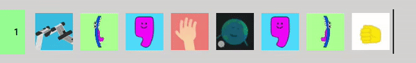

# Giflang
*The most up to date version of this repository can be found at <https://github.com/sobkulir/giflang>.*

## Hello World


## Running the IDE
Currently, there exists no live demo of Giflang and hence you'll need to build and host it on your machine.
But don't worry, it's super simple.

### Dependencies
You'll need the following:
* NodeJS (>= v10.17.0)
* npm (>= 6.13.1)
* **Chrome (>= 68) or Firefox (>= 57)**

Giflang uses [SharedArrayBuffer](https://developer.mozilla.org/en-US/docs/Web/JavaScript/Reference/Global_Objects/SharedArrayBuffer) which is only supported in Chrome and Firefox. In case of Firefox, you will need to explicitly enable the following two flags in `about:config`:
```
dom.postMessage.sharedArrayBuffer.withCOOP_COEP
javascript.options.shared_memory
```

### Set up
To install Giflang, run the following commands:
```
$ git clone https://github.com/sobkulir/giflang
$ cd giflang
$ npm install
$ npm start
```

This will start a local server and you can now open the IDE at <https://http://localhost:9000/>. If running
the Hello World program that you see when you open the IDE doesn't work, you might need to change or update your
browser (see Dependencies section above).

### Tests
Tests of the interpreter can be found in `interpreter/tests.ts`. Here's a snippet showing how to run them:
```
$ npm build && node dist/tests.js
```

## Substituting GIFs
In order to substitute GIFs for your own, simply change the ones in `frontend/public/img` folder.